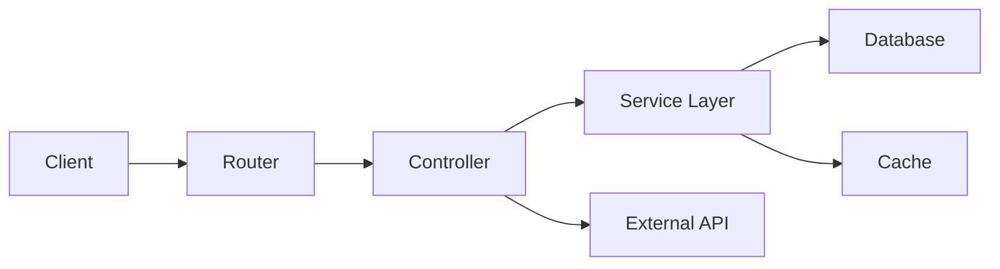
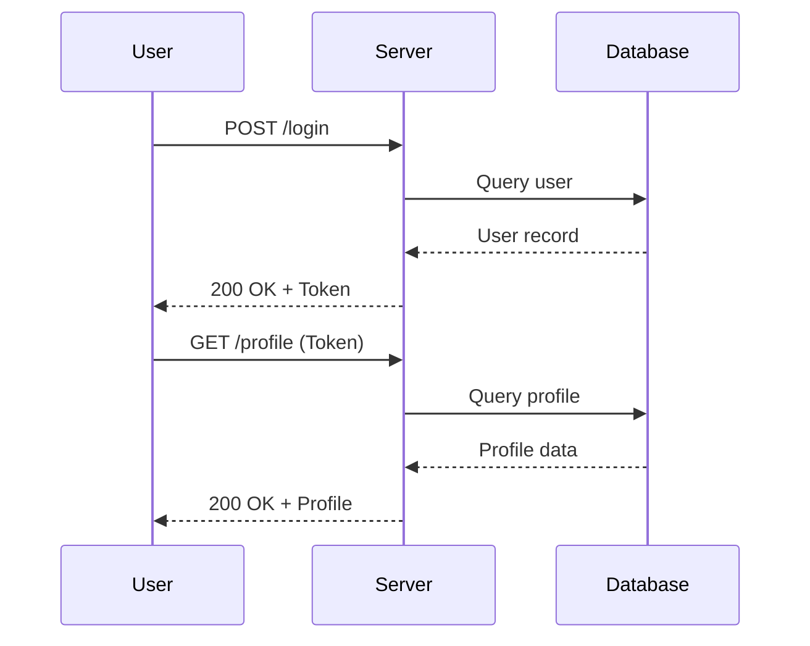

## Hello World

The classic first program.

### C

```c
#include <stdio.h>

int main(void) {
    printf("Hello, World!\n");
    return 0;
}
```

### Python

```python
def fibonacci(n: int) -> list[int]:
    """Generate Fibonacci sequence up to n terms."""
    a, b = 0, 1
    result = []
    for _ in range(n):
        result.append(a)
        a, b = b, a + b
    return result

print(fibonacci(10))
```

### JavaScript

```javascript
const debounce = (fn, delay) => {
  let timer = null;
  return (...args) => {
    clearTimeout(timer);
    timer = setTimeout(() => fn(...args), delay);
  };
};
```

## Text Formatting

This paragraph has **bold text**, *italic text*, ~~strikethrough~~, and `inline code`. You can also combine **_bold and italic_** for emphasis.

> This is a blockquote. It can span multiple lines and is useful for quoting external sources or calling attention to important information.
>
> Blockquotes can also contain **bold**, *italic*, and `code` formatting.

## Links and Images

Visit [KeLes Coding](https://keles-coding.github.io) for more content.


## Lists

### Unordered List

- First item
- Second item
  - Nested item A
  - Nested item B
- Third item

### Ordered List

1. Step one: Initialize the project
2. Step two: Configure settings
3. Step three: Deploy to production

### Task List

- [x] Set up Jekyll
- [x] Configure Tailwind CSS
- [x] Add dark mode support
- [ ] Implement search functionality
- [ ] Add RSS feed

## Tables

| Feature | Status | Priority |
|---------|--------|----------|
| Syntax Highlighting | Done | High |
| Mermaid Diagrams | Done | High |
| KaTeX Math | Done | Medium |
| Table of Contents | Done | Low |

## Horizontal Rule

Above this line is content, below is more content.

---

The horizontal rule above separates sections visually.

## Mermaid Diagram





## Math / LaTeX

Inline math: the quadratic formula is $$x = \frac{-b \pm \sqrt{b^2 - 4ac}}{2a}$$ and Euler's identity is $$e^{i\pi} + 1 = 0$$.

Display math:

$$
\int_{-\infty}^{\infty} e^{-x^2} dx = \sqrt{\pi}
$$

$$
\nabla \times \mathbf{E} = -\frac{\partial \mathbf{B}}{\partial t}
$$

## Code with Language Label

```rust
fn main() {
    let numbers = vec![1, 2, 3, 4, 5];
    let sum: i32 = numbers.iter().sum();
    println!("Sum: {}", sum);
}
```

```sql
SELECT u.name, COUNT(o.id) AS order_count
FROM users u
LEFT JOIN orders o ON u.id = o.user_id
WHERE u.created_at > '2025-01-01'
GROUP BY u.name
HAVING COUNT(o.id) > 5
ORDER BY order_count DESC;
```