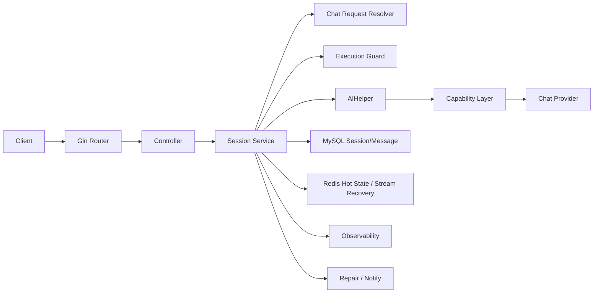

# 1. 总体设计

当前 AI 聊天链路解决的是 5 个核心问题：

1. 同一个会话的多轮上下文如何稳定维护。
2. 同步聊天和流式聊天如何复用同一套状态推进逻辑。
3. 请求中途断掉后，系统如何恢复，而不是丢失执行进度。
4. 多实例部署下，如何避免同一个会话被并发推进。
5. 当 Redis、MySQL、模型调用任意一环失败时，系统如何收敛到一个可解释、可补偿的状态。

如果用一句话概括这条链路：

> 它是一个围绕 `session` 组织的会话执行系统，而不是一个简单的大模型调用接口。

从代码结构上看，这条链路可以拆成几层：

- **Router / Controller 层**：接 HTTP 请求，做参数校验、超时控制、SSE 协议处理。
- **请求解析层**：确定这次请求最终使用的模型配置、聊天模式和运行时参数。
- **执行保护层**：保证同一个会话同一时刻只被一个执行流推进。
- **会话运行时层**：用 `AIHelper` 维护消息窗口、摘要、热状态和模型调用。
- **能力编排层**：在普通聊天、RAG、MCP 等模式上复用底层 Provider。
- **持久化与热状态层**：MySQL 保存正式历史，Redis 保存共享热状态和流式恢复状态。
- **恢复与补偿层**：在热状态可信时做快速恢复，不可信时回退数据库重建；失败时通过 repair 补偿。

整体架构如下：

