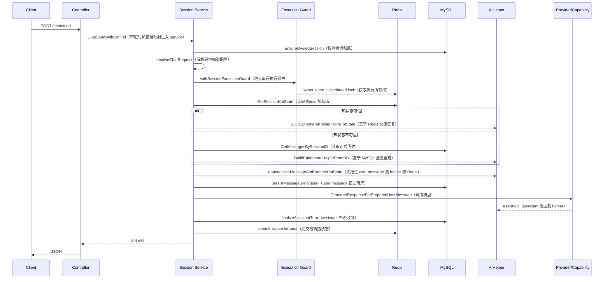
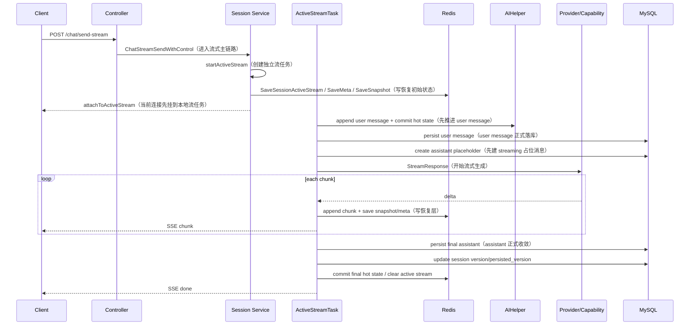

# 3. 同步与流式主链路的共同骨架

同步和流式在实现上不应该完全拆开理解。  
当前系统里，同步链路是基础版，流式链路是在基础版上加了 `active stream + resume`。

两条链路共同骨架如下：

1. 校验请求参数和会话归属。
2. 解析最终模型配置与聊天模式。
3. 进入会话执行保护。
4. 恢复或重建 `AIHelper`。
5. 先把 user message 写入 helper 和 Redis 热状态。
6. 再把 user message 正式写 MySQL。
7. 调模型生成 assistant。
8. assistant 完成后统一收敛。

区别只在第 7 步：

- 同步链路：一次性得到完整回答。
- 流式链路：通过 `activeStreamTask` 按 chunk 推进。

# 4. 同步聊天主链路

主要入口：

- `CreateSessionAndSendMessage`
- `ChatSend`

## 4.1 时序图



## 4.2 为什么是“本地锁 -> owner lease -> distributed lock”

关键代码在 [service/session/guard.go](/I:/Study/26_shixi/golang/GoMind_org/service/session/guard.go)：

```go
localLock := globalSessionLocalLockManager.getLock(sessionID)
localLock.Lock()
defer localLock.Unlock()
...
ownerLease, ownerState, err := myredis.AcquireOrRefreshSessionOwnerLease(execCtx, sessionID, currentInstanceID)
...
distributedLock, err := myredis.AcquireSessionDistributedLock(execCtx, sessionID)
```

顺序原因如下：

1. **先拿本地锁**
   - 先挡住单实例内并发。
   - 避免同机两个 goroutine 一起去抢 Redis 锁。

2. **再拿 owner lease**
   - 先确定哪个实例有执行资格。
   - 同时拿到 `OwnerID + FenceToken`，避免旧 owner 尾写。

3. **最后拿 distributed lock**
   - 保证真正推进会话的执行流只有一个。

这个顺序解决的是三层问题：

- 本机并发
- 执行所有权
- 全局串行推进

## 4.3 AIHelper 恢复或重建

当前 helper 恢复的总入口是 `getOrSyncHelperWithHistory`。

恢复策略：

1. 优先尝试 Redis 热状态。
2. 只有热状态可信时才做 warm resume。
3. 否则回退 MySQL 全量重建。

### Redis 热恢复代码

```go
hotState, err := myredis.GetSessionHotState(ctx, sessionID)
...
if hotState != nil {
    currentLease, leaseErr := myredis.GetSessionOwnerLeaseDetail(ctx, sessionID)
    ...
    if canWarmResumeFromHotState(sess, hotState, currentLease, selectionSignature) {
        helper, reused, buildErr := BuildEphemeralHelperFromHotState(ctx, userName, sess, resolved, hotState)
        ...
        manager.SetAIHelper(userName, sessionID, helper)
        return helper, code.CodeSuccess
    }
}
```

### `BuildEphemeralHelperFromHotState`

```go
func BuildEphemeralHelperFromHotState(ctx context.Context, userName string, sess *model.Session, resolved *resolvedChatRequest, hotState *model.SessionHotState) (*aihelper.AIHelper, bool, error) {
    helper, reused, err := buildExecutionHelper(ctx, userName, sess.ID, resolved)
    if err != nil {
        return nil, false, err
    }

    helper.LoadHotState(hotState)
    applySessionMetadataToHelper(sess, helper)
    return helper, reused, nil
}
```

这一步的含义是：

- 先拿一个可执行的 helper。
- 再把 Redis 中的 recent window / summary / version 装回去。
- 最后用 session 表的正式元信息校正。

### DB 重建代码

```go
func BuildEphemeralHelperFromDB(ctx context.Context, userName string, sess *model.Session, resolved *resolvedChatRequest) (*aihelper.AIHelper, bool, codePathResult) {
    helper, reused, err := buildExecutionHelper(ctx, userName, sess.ID, resolved)
    if err != nil {
        return nil, false, codePathResult{ok: false, code: code.AIModelFail}
    }

    code_ := fullReconcileHelperWithDatabase(sess, helper)
    if code_ != code.CodeSuccess {
        return nil, reused, codePathResult{ok: false, code: code_}
    }
    return helper, reused, codePathResult{ok: true}
}
```

这一步是完整重建：

- 读 MySQL 正式历史。
- 全量回放到 helper。

当前恢复机制一句话概括：

> Redis 负责加速恢复，但不是无条件信任的真相源。热状态不可信时，直接回退 MySQL。

## 4.4 为什么 user message 先写 helper 和 Redis，再写 MySQL

关键代码：

```go
func appendUserMessageAndCommitHotState(ctx context.Context, helper *aihelper.AIHelper, userName string, userQuestion string) (*model.Message, code.Code) {
    if helper == nil {
        return nil, code.CodeInvalidParams
    }
    message := helper.AddMessageWithStatus(userQuestion, userName, true, false, model.MessageStatusCompleted)
    if code_ := commitHelperHotState(ctx, helper); code_ != code.CodeSuccess {
        return nil, code_
    }
    return message, code.CodeSuccess
}
```

这一步先做：

1. 把 user message 放进 helper。
2. 把最新会话状态提交到 Redis 热状态。

然后才正式写 MySQL：

```go
func persistMessageSync(ctx context.Context, message *model.Message) code.Code {
    if message == nil {
        return code.CodeInvalidParams
    }
    if code_ := ensureSessionWriteOwnership(ctx, message.SessionID); code_ != code.CodeSuccess {
        return code_
    }
    if _, err := messageDAO.CreateMessage(message); err != nil {
        observability.RecordDBPersistFail()
        return code.CodeServerBusy
    }
    return code.CodeSuccess
}
```

当前实现的准确描述是：

> 先把 user message 推进到会话运行态和 Redis 热状态，再把它正式写入 MySQL。

这么做的直接效果是：

- 模型调用前，Redis 已经能看到这一轮用户输入。
- 恢复请求可以更早看到最新上下文。

## 4.5 模型调用前，上下文是怎么拼出来的

### `buildModelMessages`

```go
func (a *AIHelper) buildModelMessages() []*schema.Message {
    a.mu.RLock()
    defer a.mu.RUnlock()

    start := a.summaryMessageCount - a.messageWindowStart
    if start < 0 {
        start = 0
    }
    if start > len(a.messages) {
        start = len(a.messages)
    }
    if len(a.messages)-start > maxContextMessages {
        start = len(a.messages) - maxContextMessages
    }

    schemaMessages := make([]*schema.Message, 0, 1+len(a.messages[start:]))
    if a.contextSummary != "" {
        schemaMessages = append(schemaMessages, &schema.Message{
            Role: schema.System,
            Content: "以下是当前会话较早历史的摘要，请在回答时延续这些上下文信息：\n" +
                a.contextSummary,
        })
    }

    schemaMessages = append(schemaMessages, utils.ConvertToSchemaMessages(a.messages[start:])...)
    return schemaMessages
}
```

上下文拼接规则很明确：

1. 先算最近窗口从哪条消息开始。
2. 如果有历史摘要，先拼一条 `system` 消息。
3. 再拼最近窗口消息。

所以发给模型的上下文不是全量历史，而是：

- 一条历史摘要
- 最近 N 条消息

### 当前摘要刷新时机

```go
func (a *AIHelper) GenerateResponseForPreparedUserMessage(userName string, ctx context.Context) (*model.Message, error) {
    if err := a.ensureContextSummary(ctx); err != nil {
        return nil, err
    }

    messages := a.buildModelMessages()
    ...
    schemaMsg, err := a.generateWithRetryAndFallback(ctx, "generate", messages, usedSummary, func(model AIModel) (*schema.Message, error) {
        return model.GenerateResponse(ctx, messages)
    })
    ...
}
```

当前实现里，摘要刷新发生在主模型调用前。

这意味着：

- 优点：当前轮回答用到的是最新摘要。
- 缺点：如果摘要需要刷新，这一轮响应会变慢。

这个点在设计上是当前实现的 tradeoff。  
从响应速度角度看，更合理的优化方向通常是：

- 当前轮先用已有摘要回答
- assistant 生成后再异步刷新摘要

## 4.6 assistant 终态收敛

关键代码：

```go
func finalizeAssistantTurn(ctx context.Context, sess *model.Session, sessionID string, helper *aihelper.AIHelper, message *model.Message) code.Code {
    if sess == nil || helper == nil || message == nil {
        return code.CodeInvalidParams
    }
    if code_ := persistMessageSync(ctx, message); code_ != code.CodeSuccess {
        savePendingPersistHotStateBestEffort(ctx, helper)
        return code_
    }
    if code_ := persistSessionProgressWithPersistedVersion(ctx, sessionID, helper); code_ != code.CodeSuccess {
        savePendingPersistHotStateBestEffort(ctx, helper)
        return code_
    }
    if code_ := commitHelperHotState(ctx, helper); code_ != code.CodeSuccess {
        enqueueHotStateRebuildRepairBestEffort(helper)
        return code_
    }
    publishAssistantReadyNotificationBestEffort(ctx, sess, message)
    return code.CodeSuccess
}
```

assistant 完成后的收敛顺序是：

1. `persistMessageSync`：assistant 正式写 MySQL。
2. `persistSessionProgressWithPersistedVersion`：推进 `version / persisted_version`。
3. `commitHelperHotState`：提交最新 Redis 热状态。
4. `publishAssistantReadyNotificationBestEffort`：发通知，失败不回滚主链路。

这里反映出来的角色分工是：

- MySQL：正式历史真相源
- Redis：共享热状态 / 快速恢复层
- Notify / MQ：旁路能力，不参与主一致性

# 5. 流式聊天主链路

流式链路和同步链路的最大区别，不是“返回 chunk”，而是：

> 模型生成任务被抽象成独立的 `activeStreamTask`，而不是绑定在当前 HTTP 连接上。

这使得流式链路天然支持：

- stop
- detach
- resume
- 跨实例恢复

## 5.1 为什么要引入 `activeStreamTask`

如果直接在 Controller 里边调模型边写 SSE，会有几个问题：

1. 网络断开时，生成容易直接中止。
2. 无法稳定暴露 `streamId`。
3. 无法实现 resume。
4. 多实例下无法共享恢复状态。

所以当前实现引入：

- `activeStreamTask`
- `activeStreamRegistry`
- Redis `StreamResumeMeta / StreamSnapshot / StreamChunkSnapshot`

## 5.2 流式时序图



## 5.3 `startActiveStream` 的职责

关键代码：

```go
func startActiveStream(userName string, sess *model.Session, resolved *resolvedChatRequest, userQuestion string) (*activeStreamTask, code.Code) {
    if task := globalActiveStreamRegistry.getBySessionID(sess.ID); task != nil && !isTerminalStreamStatus(task.exportMeta().Status) {
        return nil, code.CodeTooManyRequests
    }
    if streamID, err := myredis.GetSessionActiveStream(context.Background(), sess.ID); err == nil && streamID != "" {
        if meta, metaErr := myredis.GetActiveStreamMeta(context.Background(), streamID); metaErr == nil && meta != nil && !isTerminalStreamStatus(meta.Status) {
            return nil, code.CodeTooManyRequests
        }
    }

    runCtx, cancel := context.WithTimeout(context.Background(), activeStreamExecutionTimeout)
    task := newActiveStreamTask(userName, sess.ID, uuid.NewString(), uuid.NewString(), cancel)
    task.setSessionVersion(sess.Version + 1)
    globalActiveStreamRegistry.register(task)

    if err := persistActiveStreamRecoveryState(task, sess.ID); err != nil {
        globalActiveStreamRegistry.unregister(task)
        cancel()
        return nil, code.CodeServerBusy
    }

    go func() {
        ...
    }()

    return task, code.CodeSuccess
}
```

这个函数做了 5 件事：

1. 检查当前 session 是否已经有未结束的流。
2. 创建新的 `activeStreamTask`。
3. 注册到本地 registry。
4. 把恢复初始状态写入 Redis。
5. 启动后台 goroutine 进行模型流式生成。

这一步的重点是：

**HTTP 请求只是 attach 到这个流任务上，不拥有流任务本身。**

## 5.4 `activeStreamTask` 的内部状态

`activeStreamTask` 主要维护三组状态：

1. **运行状态**
   - `status`
   - `messageStatus`
   - `cancelStatus`

2. **内容状态**
   - `content`
   - `nextSeq`
   - `chunks`
   - `bufferBytes`

3. **恢复状态**
   - `subscribers`
   - `resumeDeadline`
   - `ownerID`
   - `fenceToken`

最关键的几个函数：

- `buildAssistantMessage`：把当前流内容拼成正式 assistant 消息。
- `appendChunkAndCommit`：每个 chunk 先写本地，再写 Redis，再广播给订阅者。
- `attachSubscriber`：给恢复中的连接挂载订阅。
- `removeSubscriber`：连接断开时解除订阅，必要时切 `detached`。
- `finish`：把流切到终态，并关闭订阅。
- `requestStop`：主动取消当前流。

## 5.5 `ResumeStreamWithControl` / `attachToActiveStream` / `attachToRedisBackedStream`

这是流式恢复里最关键的三个函数。

### `ResumeStreamWithControl`

作用：

- 决定当前恢复到底走“本地恢复”还是“Redis 恢复”。

关键代码：

```go
func ResumeStreamWithControl(ctx context.Context, userName string, sessionID string, streamID string, lastSeq int64, writer http.ResponseWriter) code.Code {
    if _, code_ := ensureOwnedSession(userName, sessionID); code_ != code.CodeSuccess {
        return code_
    }

    if task := globalActiveStreamRegistry.getByStreamID(streamID); task != nil {
        return attachToActiveStream(ctx, writer, task, streamAttachOptions{
            includeSessionEvent: false,
            lastSeq:             lastSeq,
        })
    }
    if !myredis.IsAvailable() {
        return code.CodeServerBusy
    }

    meta, err := myredis.GetActiveStreamMeta(context.Background(), streamID)
    ...
    if code_ := ensureResumeRoutingOwnership(context.Background(), meta); code_ != code.CodeSuccess {
        return code_
    }
    if claimedMeta, code_ := tryTakeoverDetachedStreamResume(context.Background(), meta); code_ != code.CodeSuccess {
        return code_
    } else if claimedMeta != nil {
        meta = claimedMeta
    }

    return attachToRedisBackedStream(ctx, writer, userName, sessionID, meta, lastSeq)
}
```

执行顺序：

1. 校验会话归属。
2. 先查本地 registry。
3. 本地有流 -> `attachToActiveStream`。
4. 本地没有 -> 去 Redis 读 `meta`。
5. 校验 `streamId` 是否属于当前用户和当前 session。
6. 校验 owner 路由。
7. 必要时接管 detached 流。
8. 最后走 `attachToRedisBackedStream`。

一句话总结：

> `ResumeStreamWithControl` 负责选择恢复路径。

### `attachToActiveStream`

作用：

- 把当前 HTTP 连接挂到本地仍在运行或可恢复的 `activeStreamTask` 上。

关键代码：

```go
func attachToActiveStream(ctx context.Context, writer http.ResponseWriter, task *activeStreamTask, options streamAttachOptions) code.Code {
    ...
    if options.includeSessionEvent {
        writeStreamJSON(writer, flusher, map[string]interface{}{
            "type":      "session",
            "sessionId": task.sessionID,
            "streamId":  task.streamID,
            "messageId": task.messageID,
        })
    }
    writeStreamJSON(writer, flusher, map[string]interface{}{
        "type":     "ready",
        "streamId": task.streamID,
    })

    subscriberID, snapshot, backlog, status, ch := task.attachSubscriber(options.lastSeq)
    defer task.removeSubscriber(subscriberID)

    if snapshot != nil {
        writeStreamJSON(writer, flusher, map[string]interface{}{
            "type":      "snapshot",
            "streamId":  snapshot.StreamID,
            "messageId": snapshot.MessageID,
            "content":   snapshot.Content,
            "lastSeq":   snapshot.LastSeq,
        })
    }
    for _, chunk := range backlog {
        writeStreamJSON(writer, flusher, map[string]interface{}{
            "type":     "chunk",
            "streamId": chunk.StreamID,
            "seq":      chunk.Seq,
            "delta":    chunk.Delta,
        })
    }

    if isTerminalStreamStatus(status) {
        return writeDoneEvent(writer, flusher, task.streamID, status, task.exportSnapshot().LastSeq)
    }

    for {
        select {
        case <-ctx.Done():
            return code.CodeSuccess
        case event, ok := <-ch:
            ...
        }
    }
}
```

这个函数干了 5 件事：

1. 发 `session` / `ready` 事件。
2. 通过 `attachSubscriber(lastSeq)` 取到 snapshot、backlog、实时 channel。
3. 如果需要，先补一份 snapshot。
4. 再补 backlog。
5. 最后开始实时收 chunk。

一句话总结：

> `attachToActiveStream` 负责本地恢复，它的核心是“先补历史，再跟实时”。

### `attachToRedisBackedStream`

作用：

- 当本地没有流任务时，基于 Redis 恢复层跨实例恢复。

关键代码：

```go
func attachToRedisBackedStream(ctx context.Context, writer http.ResponseWriter, userName string, sessionID string, meta *model.StreamResumeMeta, lastSeq int64) code.Code {
    ...
    cursor := lastSeq
    snapshotSent := false

    for {
        ...
        meta, err := myredis.GetActiveStreamMeta(context.Background(), streamID)
        ...
        chunks, chunkErr := myredis.GetActiveStreamChunks(context.Background(), streamID)
        ...

        filtered := make([]model.StreamChunkSnapshot, 0, len(chunks))
        for _, chunk := range chunks {
            if chunk.Seq > cursor {
                filtered = append(filtered, chunk)
            }
        }

        if !snapshotSent {
            needSnapshot := false
            if len(filtered) > 0 && filtered[0].Seq > cursor+1 {
                needSnapshot = true
            }
            if len(filtered) == 0 && meta.NextSeq-1 > cursor {
                needSnapshot = true
            }
            if needSnapshot {
                snapshot, snapshotErr := myredis.GetActiveStreamSnapshot(context.Background(), streamID)
                ...
                cursor = snapshot.LastSeq
                snapshotSent = true
            }
        }

        for _, chunk := range filtered {
            ...
            cursor = chunk.Seq
        }

        if isTerminalStreamStatus(meta.Status) {
            return writeDoneEvent(writer, flusher, streamID, meta.Status, cursor)
        }

        time.Sleep(400 * time.Millisecond)
    }
}
```

这个函数的关键逻辑是：

1. 只补 `seq > lastSeq` 的 chunk。
2. 如果 chunk 已经断档，就不能只补增量，而是发一份 snapshot。
3. 轮询 Redis，看流是否已经进入终态。

一句话总结：

> `attachToRedisBackedStream` 负责跨实例恢复，它会在“补 chunk”和“补 snapshot”之间做选择。