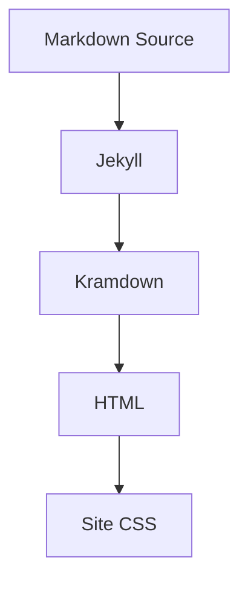

# Markdown 渲染测试基准

这篇文章用于检查站点对 Markdown 的渲染覆盖。它包含常见技术博客会使用的标题、段落、列表、表格、代码、公式、图表、图片、脚注和提示块。

## 1. 文本

普通段落应该保持稳定的中文阅读密度。这里混合 English words、`inline code`、**粗体**、*斜体*、~~删除线~~ 和一个较长的链接：[Jekyll Markdown documentation](https://jekyllrb.com/docs/configuration/markdown/)。

超长英文 token 不应该撑破布局：`ThisIsAVeryLongIdentifierNameDesignedToVerifyInlineCodeWrappingInsideThePostContentArea`。

## 2. 列表

- 第一层无序列表
- 包含一段较长文本的列表项，用来检查换行缩进是否和项目符号对齐。
  - 第二层无序列表
  - 第二层的另一个项目
- 回到第一层

1. 第一层有序列表
2. 第二项
   1. 嵌套有序列表
   2. 嵌套列表的第二项
3. 第三项

- [x] 已完成任务
- [ ] 未完成任务

## 3. 引用与提示块

> 普通引用块用于引用资料、解释背景，应该和正文有明显区分，但不能压过正文。

> [!NOTE]
> 这是一个说明提示块，适合补充上下文。

> [!TIP]
> 这是一个技巧提示块，适合写解题思路或实践建议。

> [!WARNING]
> 这是一个警告提示块，适合提醒边界条件。

## 4. 表格

| 类型 | Markdown 写法 | 预期效果 |
| --- | --- | --- |
| 行内代码 | `` `code` `` | 背景区分、不会过高 |
| 代码块 | 三个反引号 | 支持高亮和横向滚动 |
| 公式 | `$a^2 + b^2 = c^2$` | 行内渲染 |
| 图表 | `mermaid` 代码块 | 渲染为 SVG 图 |

## 5. 代码

```cpp
class Solution {
public:
    int longestConsecutive(vector<int>& nums) {
        unordered_set<int> seen(nums.begin(), nums.end());
        int best = 0;

        for (int value : seen) {
            if (seen.count(value - 1)) continue;

            int current = value;
            int length = 1;
            while (seen.count(current + 1)) {
                current++;
                length++;
            }
            best = max(best, length);
        }

        return best;
    }
};
```

```go
func longestConsecutive(nums []int) int {
	seen := map[int]bool{}
	for _, n := range nums {
		seen[n] = true
	}

	best := 0
	for n := range seen {
		if seen[n-1] {
			continue
		}
		length := 1
		for seen[n+length] {
			length++
		}
		best = max(best, length)
	}
	return best
}
```

```json
{
  "title": "Markdown 渲染测试基准",
  "features": ["code", "table", "math", "mermaid"],
  "visible": true
}
```

```bash
bundle exec jekyll serve --livereload
```

无语言代码块：

```
plain text
no language class
```

## 6. 公式

行内公式：$a^2 + b^2 = c^2$。

块级公式：

$$
\sum_{i=1}^{n} i = \frac{n(n + 1)}{2}
$$

## 7. Mermaid



## 8. 图片


*图片说明：图片说明文字应该比正文更轻，不影响文章节奏。*

## 9. 脚注

这是一段带脚注的文本。[^markdown-note]

[^markdown-note]: 脚注内容应该在文章底部保持清晰、紧凑，并且容易从正文跳转回来。
