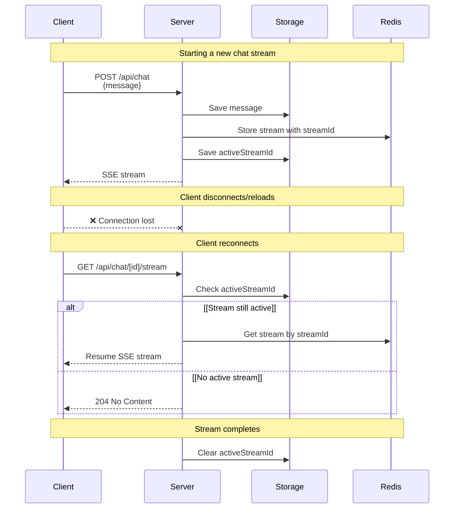

# 1. 流式传输的实现：方案笔记

流式传输用于提升大型语言模型（LLM）应用程序的响应性至关重要，能够显著提升用户体验。

本文是一篇方案笔记，主要梳理主流流式传输方式、应用级事件流和 resume streams 的设计取舍。Orbit v0.1 MVP 阶段的具体落地记录放在《MVP 流式消息实现：LangChain Streaming / SSE / 前端增量渲染》中。

# 2. 主流实现方案

当前主流 LLM 应用中，流式传输通常由两层组成：
```text
1. 模型调用层开启 streaming
2. 应用传输层使用 SSE 或类似机制把增量内容推给前端
```

## 2.1 纯 `SSE` 转发
```text
Browser
  -> POST /chat
      -> Backend 调 OpenAI / Claude / Gemini stream
          -> Backend 把 provider chunks 转成 SSE
              -> Browser 渲染
```
优点是简单，延迟低，后端几乎无状态。SSE 本身适合一对多/服务端到客户端的单向推送，和 WebSocket 相比，它是 server-to-client 的单向流；WebSocket 更适合双向低延迟交互。

问题也明显：
```text
用户刷新页面
  -> 原 HTTP 连接断开
  -> 后端请求可能被 abort
  -> provider stream 也被取消
  -> assistant partial message 可能只存在前端内存里
```

## 2.2 应用级事件流

纯 `SSE` 转发虽然简单，但不适合作为长期架构。因为不同模型供应商或框架的流式输出结构并不一致[^OpenAI_Streaming][^Claude_Streaming]：

```text
OpenAI
  -> typed streaming events

LangChain
  -> messages / updates / custom

Claude / Gemini / Ollama
  -> 各自的 chunk / event 结构
```

如果前端直接消费这些原始 chunk，后续多模型接入、工具调用、Agent Run、错误处理和断点续传都会变得复杂。

因此，更推荐的方式是：后端先把不同来源的流式输出统一转换成应用内部事件，再通过 SSE 推给前端。

```text
Provider / LangChain 原始 chunk
  -> Backend Stream Adapter
      -> OrbitStreamEvent
          -> SSE
              -> Frontend
```

这里的关键点是：

```text
SSE 是传输层
OrbitStreamEvent 是应用协议层
```

也就是说，前端不关心底层使用的是 OpenAI、Claude、Gemini 还是本地模型，只关心 Orbit 自己定义的事件类型。

一个最小事件集合可以是：

```text
message.created
message.delta
message.completed
message.failed
error
ping
```

后续支持工具调用和 Agent Run 时，再扩展为：

```text
tool.call.created
tool.call.delta
tool.result
run.step
run.progress
```

一次普通 assistant 回复的 SSE 事件可以是：

```text
id: 1
event: message.created
data: {"message_id":"msg_2","role":"assistant","status":"streaming"}

id: 2
event: message.delta
data: {"message_id":"msg_2","delta":"流式传输的核心是"}

id: 3
event: message.delta
data: {"message_id":"msg_2","delta":"让前端尽早接收到模型生成的增量内容。"}

id: 4
event: message.completed
data: {"message_id":"msg_2","status":"completed","finish_reason":"stop"}
```

对于当前项目，由于底层 LLM Client 计划基于 LangChain[^LangChain_Streaming]，可以优先做如下映射：

```text
LangChain messages
  -> message.delta

LangChain updates
  -> run.step / tool.call / tool.result

LangChain custom
  -> run.progress / tool.progress
```

这样可以把模型调用层、应用事件层和前端 UI 层解耦。

后续的 `resume streams` 也应该建立在这套事件流之上：只要每个事件都有递增的 `id` 或 `sequence_no`，前端断线后就可以根据最后收到的事件位置继续恢复。

## 2.3 resume streams：通过订阅实现活跃流的恢复
在 2.2 的事件流基础上，进一步可以实现活跃流恢复。resume streams 解决的不是 `model` 层面的继续生成，而是前端断线重连或多个相同客户端（同一user、同一session）实现对同一个 `stream` 的跟随。

AI SDK 的 `resume streams`[^AI_SDK_resume] 的关键设计为：
```text
chat_id -> activeStreamId
activeStreamId -> Redis 中的 UIMessage stream
客户端刷新后 -> GET /api/chat/[id]/stream
后端查 chat.activeStreamId
如果存在 -> resumeExistingStream(activeStreamId)
如果不存在 -> 204 No Content
```
其中，stream resumption 不负责提供消息和 active stream 的持久化；它提供的是 `useChat` 的 `resume` 选项、`consumeSseStream` 回调，以及自动请求恢复端点的机制。需要自己做数据的存储、Redis、POST 创建 stream 接口、GET 恢复 stream 接口。

完整生命周期：
```text
1. POST /api/chat
   - 保存用户消息
   - 调用 streamText
   - 创建 streamId
   - 把 SSE stream 放入 resumable-stream / Redis
   - 把 activeStreamId 保存到 chat 记录

2. 前端正常接收 SSE

3. 页面刷新 / 重新挂载 useChat
   - useChat(resume: true) 自动 GET /api/chat/[id]/stream

4. GET /api/chat/[id]/stream
   - 读取 chat.activeStreamId
   - 没有则返回 204
   - 有则 resumeExistingStream(activeStreamId)

5. stream 完成
   - onFinish 保存最终 messages
   - 清空 activeStreamId
```

即：
```
chat.messages 是持久化的
chat.activeStreamId 是持久化的
流本身被封装成可恢复 stream
```
这样的话，前端连接的连接与否，不会影响后端的生成，而后端使用订阅制，实现一或多个客户端的推送，多个相同（同一 `user` + 同一 `session`）的客户端能够跟随同一对话流。

一个需要注意的是，这个是为了实现：
```text
页面刷新 / 客户端断线后的继续接收当前仍在进行的 stream
```
而非
```text
模型请求中断后，从中断 token 位置继续生成
```
这是模型层面的终端，一般的出现条件为：
- 服务端：模型交互逻辑的错误。
- 客户端：用户手动断连。

参考时序图[^AI_SDK_resume]：


# To Be Continue...

[^OpenAI_Streaming]: https://developers.openai.com/api/docs/guides/streaming-responses
[^Claude_Streaming]: https://platform.claude.com/docs/zh-CN/build-with-claude/streaming
[^LangChain_Streaming]: https://docs.langchain.com/oss/python/langchain/streaming
[^AI_SDK_resume]: https://ai-sdk.dev/docs/ai-sdk-ui/chatbot-resume-streams
